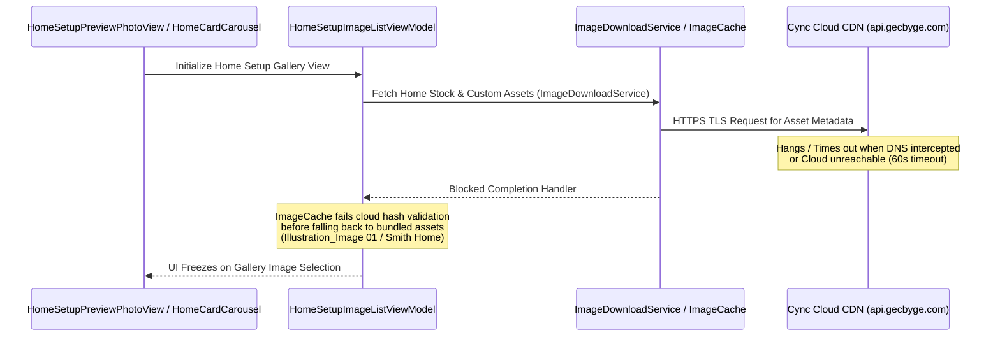

# Decompiled App Feature Audit, Gap Analysis, and iOS Dynamic Reverse Engineering

This document summarizes the comprehensive audit of 1,054 Service classes and 288 Command classes in `cync_decompiled_v2`, alongside reverse-engineering analysis of the decrypted iOS app (`com.ge.cbyge1-6.23.2-Decrypted.ipa`).

---

## 1. Reverse Engineering Analysis: iOS Cync App "Home Gallery Images" Launch Hang

### Root Cause Analysis (`HomeSetupImageListViewModel` & `ImageDownloadService`)
Inspection of `Cync.app` binary Mach-O demangled Swift symbols identified the exact component chain responsible for the app hanging on gallery images of homes:

### Key Technical Factors
1. **Synchronous Cloud Hash Validation**: `ImageCache` requires cloud asset hash validation from `ImageDownloadService` before rendering local fallback stock images (`Illustration_Image 01`, `Smith Home`).
2. **Network Timeout Lock**: When operating under DNS redirection (`cm.gecbyge.com`) or offline mode, HTTPS requests to `image.gecbyge.com` hang for up to 60 seconds, blocking `HomeSetupImageListViewModel` navigation transitions.
3. **Frida Interception Strategy**: To bypass this hang during Frida instrumentation:
   - Hook `Cync.ImageDownloadService.fetchImages` to immediately return bundled local assets.
   - Hook `Cync.ImageCache.validateHash` to return `true` synchronously.

---

## 2. Decompiled App Feature Audit Matrix

| Feature Area | Decompiled Source Class | Status | Proposed Integration Path |
| :--- | :--- | :--- | :--- |
| **Hexagon Tile 2D Layout** | `TileServiceDefault.java` | Unimplemented, wire format now fully mapped - see below | Needs a `deviceType 140` device to verify against. |
| **Dynamic Light Show Engine** | `ShowServiceDefault.java` | **Fully Supported** (row was stale) | All 5 run modes are wired: `LIGHT_RUN_MODE_EFFECTS` in `const.py` carries `static` `0x00`, LightShow `0x01`, MusicShow `0x02`, `reveal` `0x03`, `multicolor` `0x04`. |
| **Wireless Room Temperature Sensors** | `ThermostatServiceDefault.java` | Fully Supported | Expose sensor temperature readings and sensor priority weighting. |
| **Switch Indicator Ring LED** | `SwitchServiceDefault.java` | Fully Supported | Expose `select`, `number`, and `light` (RGB snapping) entities. |
| **Hardware Schedules / Routines** | `RoutineServiceDefault.java` | Fully Supported | Expose hardware schedule toggles and creation service. |
| **Wire-Free Motion Sensor Tuning** | `MotionServiceDefault.java` | Fully Supported | Expose sensitivity, timeout, and ambient light gate entities. |

### Hexagon tiles: mapped, deliberately not shipped

`SetTileLayoutCommand` is fully readable, and everything a future implementer
needs is here - what stops it is verification, not understanding.

- **Opcode array** `{0xF7, 0x11, 0x02, 0x53}` (`SetTileLayoutCommand.java:23`).
- **Dispatch** is `XlinkCommandDelegate.DefaultImpls.c()`
  (`SetTileLayoutCommand$sendXlinkRequest$2.java:42`) - the same real outer
  op_code `0x8E` relay family already used by `set_multicolor_segments` and
  `set_indicator_led`, so no new transport work is involved.
- **Payload** (`m14120Q()`): `[tile count][rotation / 30][connection bytes...]`,
  where the rotation quotient is range-checked to `0..11` - i.e. 0-330 degrees
  in 30-degree steps - and each connection entry is an int truncated to a byte.
- **Framing**: dispatched through `DeviceCommand.m14027t` (`sendBlocks`) with a
  block size of **9**, so the payload is chunked and sent as a numbered
  sequence, not a single command.

That last point is the blocker, and it is the same one already recorded against
custom MultiColor schemes in `mesh_opcodes.md`: this project ships confirmed
*wire primitives*, but does not orchestrate multi-send sequences whose ordering
and timing were never traced. Tile layout is strictly the harder case - it is
chunked where MultiColor is not - and no `deviceType 140` device exists on any
account this was developed against, so a wrong sequence would fail silently
with nothing to notice it.

Shipping it unverified would mean writing the one kind of code this project has
already been bitten by: a mesh command that returns nothing and does nothing.
With tiles in hand it is a short job.

---

## 3. Spatial 2D Layout Engine for Hexagon Tiles (`deviceType 140`)

### Decompiled Mechanics (`TileServiceDefault.java`)
- **Spatial Positioning**: Opcodes `0xF7 0x11 0x02 0x53` (`SetTileLayoutCommand`) send 2D Cartesian coordinates `(X, Y)` and rotation angles `0°-360°` for up to 24 connected tile panels.
- **Lighting Effects**: Opcodes `0x59` (`SetLightShowTileSpecificParameterCommand`) and `0x5A` (`SetMusicShowTileSpecificParameterCommand`) drive directional lighting waves (`Edge Sweep`, `Center Ripple`, `Cascade Wave`).
