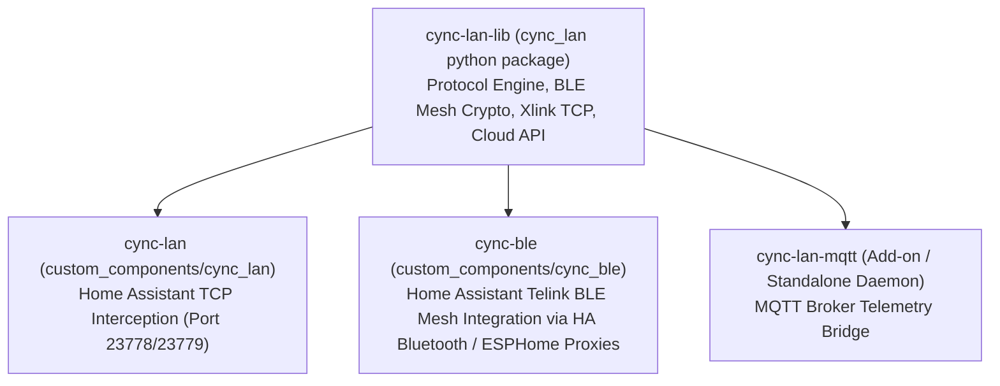

# Control Pathways and Application Transport Protocols

This document details the control pathways, transport mechanisms, repository architecture, and iOS `CbyGEKit.framework` reverse-engineering discoveries.

---

## 1. Repository Architecture & Inter-Component Integration

### Component Roles
- **`cync-lan-lib` (`cync_lan`)**: The core protocol Python library providing `BleMeshSession`, `TelinkEncrypter`, `CyncCloudAPI`, and the Xlink TCP packet layer (`packet/builder.py`).
- **`cync-lan`**: Home Assistant custom component integration controlling Wi-Fi devices over TCP socket interception (`23778` plaintext / `23779` TLS), which requires DNS redirection.
- **`cync-ble`**: Home Assistant custom component integration controlling devices over Telink Bluetooth Mesh (`iot_class: local_polling`) using Home Assistant's native Bluetooth stack (`bleak_retry_connector` and ESPHome Bluetooth Proxies).
- **`cync-lan-mqtt`**: Standalone daemon bridging local device telemetry to standard MQTT topics.

### There is no local UDP transport

Earlier revisions of this document listed a fifth pathway, "Direct Local UDP
(Port 5987)", at "Native / Core Ready" confidence, and named an `XlinkUdpClient`
library component. **Both were wrong.** No such component was ever written, and
the transport does not exist on the hardware.

The vendor SDK bundled in the Android app (`io.xlink.wifi.sdk`) genuinely
defines the protocol - discovery, an `MD5(access_key)` handshake, datapoint
writes, pipe, keep-alive - on `XlinkProperty.DEVICE_PORT = 5987`. The firmware
does not implement it. All 46 Wi-Fi devices on the development account return
ICMP port-unreachable on UDP 5987, and a sweep of the surrounding port ranges
found no UDP listener at all.

The protocol is mapped in full, and the credential it needs is already exported
by `cloud_api.py`, so this is recoverable if a firmware version ever opens the
port. See `cync-lan-research/findings/xlink_local_udp_absent.md`.

TCP interception remains the only local pathway to Wi-Fi devices, so the DNS
redirection requirement stands.

---

## 2. Reverse-Engineered iOS `CbyGEKit.framework` Discoveries

Inspection of the decrypted iOS IPA (`com.ge.cbyge1-6.23.2-Decrypted.ipa`) revealed 113 Swift protocol classes inside `Payload/Cync.app/Frameworks/CbyGEKit.framework/CbyGEKit`:

### Key iOS BLE Mesh Classes

| Swift Class Name | Protocol Purpose |
| :--- | :--- |
| **`BLEManager`** | CoreBluetooth central manager delegate (`didDiscoverPeripheral`, `didConnectPeripheral`). |
| **`Telink` / `TelinkNotifications`** | Telink GATT packet framing and notification handler. |
| **`ProxyManager`** | BLE mesh proxy node selection and session maintenance. |
| **`OfflineProxyCandidateSelectionStrategy`** | Proxy candidate selection algorithm when operating offline without cloud ping. |
| **`QualifyMeshOperation`** | Mesh health qualification procedure during initial pairing. |
| **`AssignUniqueMeshAddress`** | Dynamic mesh unicast address allocation (`0x0001` - `0x00FF`). |
| **`ConnectAndPairOperation`** | AES-128 key exchange and pairing sequence. |
| **`SetDataPointCommand`** | DataPoint state transmission (`SetBoolDataPointCommand`, `SetHumidityDataPointCommand`). |

---

## 3. BLE Mesh Proxy Selection Strategy (`OfflineProxyCandidateSelectionStrategy`)

### Single Mesh Session Architecture
- In `cync_ble`, Home Assistant maintains a single `BleMeshSession` connected to an optimal proxy node rather than holding individual connections to 40+ devices simultaneously.
- When an offline proxy drops, `OfflineProxyCandidateSelectionStrategy` picks the next candidate node based on signal RSSI and proxy capability bits.
- Mesh relays broadcast commands across the household BLE mesh via `0x8E` encrypted mesh envelopes.
