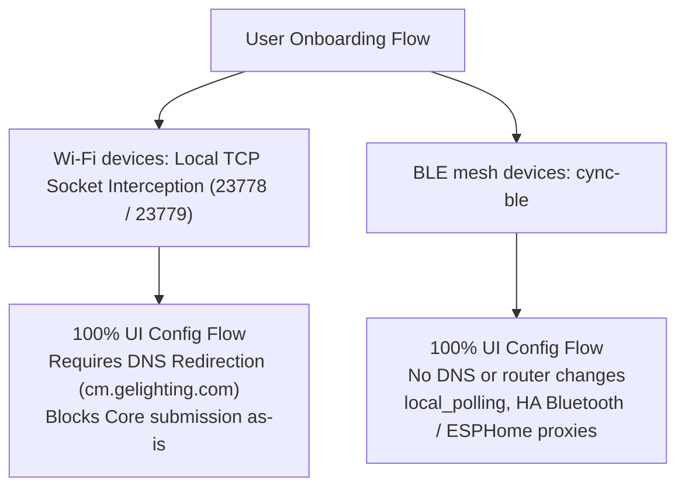
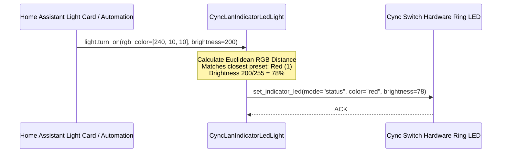

# Home Assistant Integration Architecture and UI/UX Standards

This document presents the Home Assistant integration architecture, unified Core submission blueprint, and UI/UX design standards for `cync_lan`.

---

## 1. Home Assistant Core Submission Strategy

> **Superseded.** This section previously described a two-tier strategy whose
> first tier was a zero-config "Direct Local UDP (Port 5987)" onboarding path,
> marked Core Submission Ready. **That transport does not exist.** It is defined
> in the bundled vendor SDK but not implemented by the firmware - all 46 Wi-Fi
> devices on the development account refuse UDP 5987, and no UDP listener was
> found on any nearby port. See
> `cync-lan-research/findings/xlink_local_udp_absent.md`.
>
> No zero-DNS onboarding path for Wi-Fi devices is currently known.

Core submission requires 100% UI config flow and no mandatory router or DNS
reconfiguration. `cync_lan` meets the first and, for Wi-Fi devices, cannot
currently meet the second:

The DNS-redirection requirement is what keeps `cync_lan` itself out of Core
today. `cync-ble` is the pathway with no such requirement, which is why it -
not a UDP tier - is the Core-eligible sibling.

---

## 2. Entity-First & Preset Snapping UI/UX Architecture

### Universal Principles
1. **Entity-First**: Every configurable hardware setting, state telemetry point, and control trigger MUST be exposed as a native **Home Assistant Entity** (`light`, `fan`, `climate`, `select`, `number`, `switch`, `button`, `sensor`, `binary_sensor`) rather than hidden in Options Flow menus.
2. **UI Snapping & Presets**: When hardware only supports discrete modes or step values, native entities map smooth UI controls to the closest hardware preset.

---

## 3. Special Pattern: Indicator LED Light Entity (`CyncLanIndicatorLedLight`)

Cync smart switch ring indicators support 4 discrete hardware colors: `White`, `Red`, `Green`, `Blue`. To allow automations, HomeKit/Siri, Alexa, and HA light cards to control the ring, the indicator is exposed as a `LightEntity`:

### Preset RGB Mapping

| Preset Name | Target Hardware Code | Reference RGB | Equivalent Effect Option |
| :--- | :--- | :--- | :--- |
| **White** | `0` | `(255, 255, 255)` | `White` |
| **Red** | `1` | `(255, 0, 0)` | `Red` |
| **Green** | `2` | `(0, 255, 0)` | `Green` |
| **Blue** | `3` | `(0, 0, 255)` | `Blue` |

---

## 4. Boundary Matrix: Hub Options Flow vs. Native Device Entities

### Hub Options Flow (`config_flow.py` Options Flow)
Reserved exclusively for integration-wide system settings and guided multi-step wizards:
- **Local TCP Listener Mode (`CONF_ENABLE_TCP_LISTENER`)**: System background TCP socket server.
- **Light Group Generation Policy (`CONF_ENABLE_LIGHT_GROUPS`)**: Aggregation policy.
- **Hide Group Members Policy (`CONF_HIDE_GROUP_MEMBERS`)**: Registry entry hider.
- **Device Refresh Interval (`CONF_DEVICE_LIST_REFRESH_INTERVAL`)**: 24h background timer.
- **Experimental Features Flag (`CONF_ENABLE_EXPERIMENTAL`)**: Global safety gate.
- **Guided Commissioning Wizards**: BLE onboarding and sleeping battery device wake-up wizards.

### Native Device Entities (HA Device Cards)
All single-property physical device controls are exposed directly on HA device cards under `EntityCategory.CONFIG`:
- **Switch Ring LED**: `select.indicator_led_mode`, `select.indicator_led_color`, `number.indicator_led_brightness`, `light.indicator_led_light`.
- **Motion Sensor**: `select.motion_sensor_sensitivity`, `number.motion_sensor_timeout`, `select.ambient_light_gate`.
- **Smart Switch Relay**: `switch.smart_bulb_mode` (decoupled relay mode).
- **Routines & Schedules**: `switch.schedule_enable` (hardware schedule toggles).
- **Thermostat**: `select.sensor_priority_mode`, `number.temperature_calibration_offset`.
