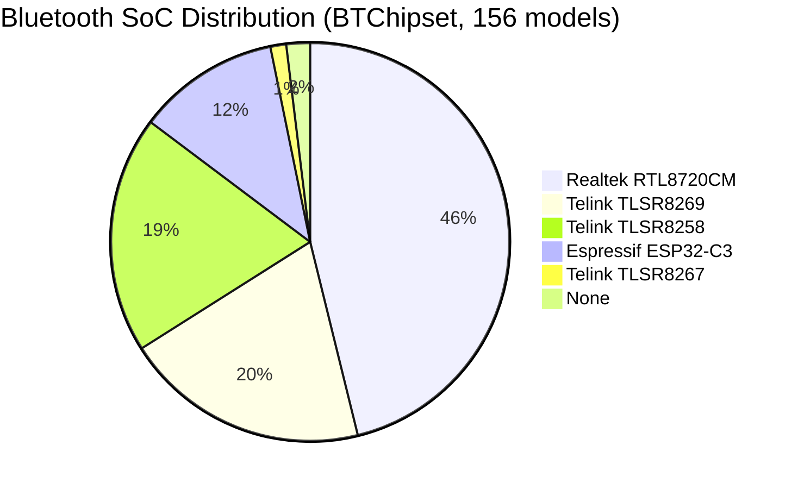
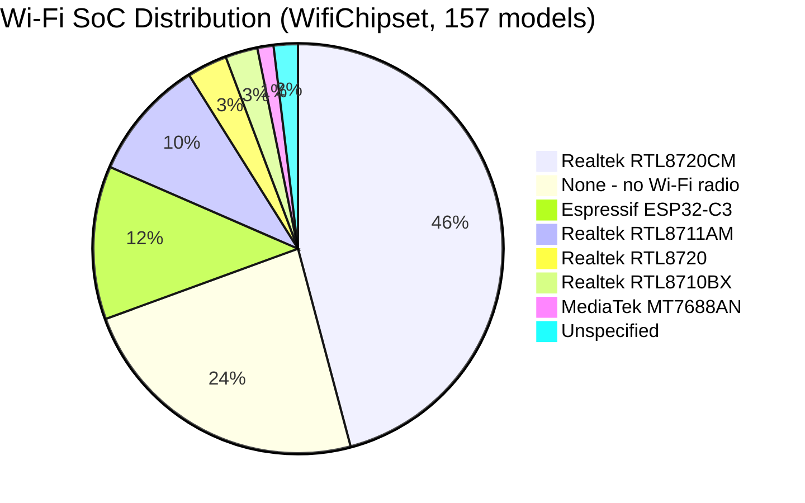

# Hardware Chipset Specifications and Hardware Limitations

This document provides a comprehensive overview of hardware microcontrollers, BLE chipsets, flashing targets, and physical hardware bounds across the Cync hardware fleet.

---

## 1. Microcontroller & Chipset Distribution (157 Models)

**Source: the app states this itself.** `product/BTChipset.java` and
`product/WifiChipset.java` are first-class enums, and `product/DeviceType.java`
assigns both to every model. So these are not teardown inferences or guesses
from model names - they are the manufacturer's own per-model declarations, and
the counts below are a direct tally of those assignments (156 BT assignments and
157 WiFi assignments across 157 device types).

### Hardware Fleet Summary

| SoC / Chipset Family | Architecture | Models | Common Form Factors | Serial Flashing Mode | Open-Source Targets |
| :--- | :--- | :--- | :--- | :--- | :--- |
| **Realtek AmebaD** (`RTL8720CM`) | ARM Cortex-M4F / M0 | 72 (BT **and** Wi-Fi - one combo part) | Direct Connect Bulbs, Strips, Smart Plugs | UART Download Pin (Log TX/RX) | OpenBeken (`amebad`) |
| **Telink BLE** (`TLSR8258` / `TLSR8269` / `TLSR8267`) | 32-bit Proprietary RISC | 63 (30 / 31 / 2) | C-Life/C-Sleep Bulbs, Wire-Free Switches, Remotes | Single-wire Swire (SWS) | Telink OTA / OpenBeken |
| **Espressif** (`ESP32-C3`) | 32-bit RISC-V | 18 BT / 19 Wi-Fi | Dynamic Effects Strips, Hexagon Tiles | GPIO0 Low + UART TX/RX | ESPHome, Tasmota32 |
| **Realtek** (`RTL8711AM`) | ARM Cortex-M3 | 15 | Earlier Wi-Fi models | UART Download Pin | OpenBeken (`rtl8710a`) |
| **Realtek** (`RTL8720`, non-CM) | ARM Cortex-M4F / M0 | 5 | Earlier Wi-Fi models | UART Download Pin | OpenBeken (`amebad`) |
| **Realtek AmebaZ** (`RTL8710BX`) | ARM Cortex-M4 | 4 | Early Wi-Fi Smart Plugs, 4-Wire Switches | UART Download Pin | OpenBeken (`rtl8710b`) |
| **MediaTek** (`MT7688AN`) | MIPS24KEc 580MHz | 2 | C-Reach Bridge Hub | UART Serial Console (115200) | OpenWrt |

### Two things this table implies for any "reflash it" plan

**37 of 157 models have no Wi-Fi radio at all** (`WifiChipset.NONE`) - the
BLE-only accessories: standalone motion sensors, wire-free switches, remotes.
No ESPHome or LibreTiny image can ever apply to them, whatever happens with the
Realtek parts. The BLE mesh is the only local route to that third of the fleet,
which is what `cync-ble` exists for.

**The Realtek fleet is four parts, not one.** `RTL8720CM` dominates at 72, but
`RTL8711AM` (15), `RTL8720` non-CM (5) and `RTL8710BX` (4) are separate silicon
with separate LibreTiny/OpenBeken targets. A flashing effort that assumes one
Realtek part covers ~60% of Wi-Fi models, not all of them.

The **flashing modes and open-source targets** columns are the one part of this
table the app does *not* supply - those come from the chips' own public
documentation and the LibreTiny/OpenBeken target lists, not from Cync. Nothing
here has been tried against a real device, and no claim is made that these parts
are actually flashable as shipped; a locked or signed bootloader would not be
visible from any of this.

---

## 2. Hardware Limitations, Range Constraints, and Bounds

### Summary Matrix of Hardware Bounds

| Hardware Family | Feature / Setting | Decompiled SDK Bound | Home Assistant Default | Required Entity Adaptation |
| :--- | :--- | :--- | :--- | :--- |
| **Dimmer Switches / Plugs** | Minimum Dimming Floor | **`5%` Minimum Floor** | `1/255` (`0.4%`) | Clamp low brightness commands (`<5%`) to `5%` minimum floor to prevent AC triac flicker. |
| **Tunable & Color Bulbs** | Color Temperature Range | **`2000K` to `7000K`** (142 - 500 Mireds) | `2700K` to `6500K` | Set `_attr_min_color_temp_kelvin = 2000` and `_attr_max_color_temp_kelvin = 7000`. |
| **Fan Controllers** | Fan Speed | **4 Discrete Speeds** (`25%, 50%, 75%, 100%`) | Continuous `0-100%` | Set `_attr_percentage_step = 25` so UI sliders snap cleanly to 25% steps. |
| **Smart Thermostats** | Target Temperature Range | **`50°F` to `90°F`** (`10°C` to `32°C`) | Generic `7°C` to `35°C` | Set `_attr_min_temp = 10` and `_attr_max_temp = 32`. |
| **Smart Thermostats** | Heat/Cool Deadband | **`3°F` (`1.5°C`) Minimum Gap** | None | Enforce 1.5°C minimum gap between target heating and cooling setpoints. |
| **Motion Sensors** | Motion Timeout Bounds | **`15s` to `900s`** (15s - 15min) | Arbitrary | Set `native_min_value = 15` and `native_max_value = 900`. |
| **Switch Indicator LED Ring** | Color Selector | **4 Discrete Presets** (`White, Red, Green, Blue`) | Full RGB wheel | Calculate Euclidean distance to snap RGB wheel inputs to closest of 4 presets. |

---

## 3. Physical Hardware Requirements for Sleeping Battery Devices

### Battery Device Deep Sleep Behavior
- **Battery Devices** (Wire-Free Motion Sensors `deviceType 60`, Wire-Free Switches `deviceType 66`, Wire-Free Remotes `deviceType 65`) operate in a deep sleep state to save power.
- BLE/Wi-Fi radios remain turned off until physically woken up (e.g. holding the side button for 5 seconds until the LED turns green).
- **Wake-Up Requirement**: Settings payloads sent to sleeping battery devices will drop silently. Configuration must be gated by a guided wizard checking `bridge.is_online(node.id)`.
